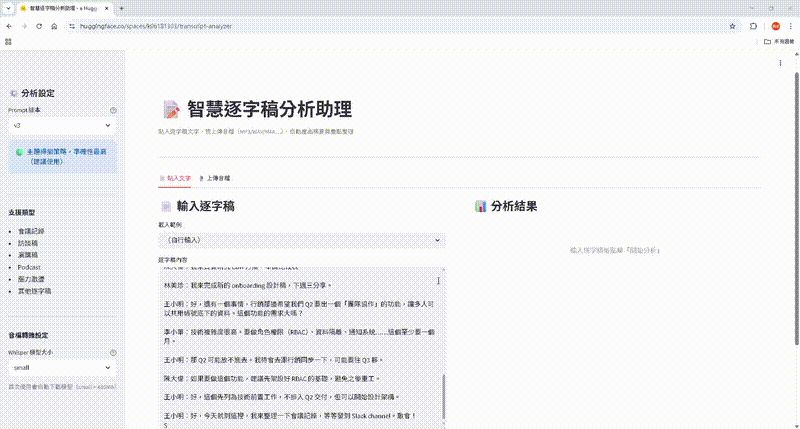

# 📝 智慧逐字稿分析助理

貼入任意逐字稿（會議、訪談、演講、Podcast…），自動產出**摘要、重點整理、關鍵詞、發言者**。

## Demo



🔗 **線上試用：** [huggingface.co/spaces/k06181303/transcript-analyzer](https://huggingface.co/spaces/k06181303/transcript-analyzer)

## 功能

| 功能 | 說明 |
|------|------|
| 通用逐字稿分析 | 會議、訪談、演講、Podcast、腦力激盪均支援 |
| 結構化摘要 | 使用 Claude Haiku，輸出繁體中文 |
| 重點整理 | 5–8 項完整句子，逐主題涵蓋 |
| 關鍵詞萃取 | 3–8 個核心名詞 / 術語 |
| 發言者辨識 | 自動辨識發言者，無發言者時回傳空 |
| 長逐字稿處理 | 以 tiktoken 計算 token 數，超過上限自動分段合併 |
| Prompt 版本選擇 | v1 通用 / v2 類別清單 / v3 主題掃描（預設） |

## 技術架構

```
逐字稿文字
    │
    ▼
streamlit_app.py（UI）
    │
    ▼
app/summarize.py
  ├── tiktoken   → token 分段
  ├── instructor → 強制結構化輸出（Pydantic）
  └── Claude Haiku（Anthropic API）
    │
    ▼
MeetingSummary
  ├── summary      整體摘要
  ├── key_points   重點整理
  ├── participants 發言者
  └── keywords     關鍵詞
```

## Prompt 版本比較（LLM-as-judge，5 種逐字稿類型）

| 指標 | v1 | v2 | v3（預設） |
|------|:--:|:--:|:----------:|
| 完整度（/5） | 4.00 | 3.60 | **4.00** |
| 準確性（/5） | 4.00 | 3.20 | **4.60** |
| 格式正確率 | 100% | 100% | 100% |
| key_points 涵蓋率 | 76% | 64% | **76%** |

## 本地安裝

```bash
git clone <repo-url>
cd meeting-assistant

python -m venv venv
venv\Scripts\activate        # Windows
# source venv/bin/activate   # macOS / Linux

pip install -r requirements.txt
cp .env.example .env
# 填入 ANTHROPIC_API_KEY

streamlit run streamlit_app.py
```

## 專案結構

```
meeting-assistant/
├── streamlit_app.py       # Streamlit UI 進入點
├── app/
│   ├── models.py          # Pydantic 資料模型
│   ├── summarize.py       # Claude Haiku 摘要（tiktoken + instructor）
│   ├── transcribe.py      # 音檔轉文字（Whisper API）
│   └── main.py            # FastAPI（選用）
├── prompts/
│   ├── v1.txt             # 通用寬鬆版
│   ├── v2.txt             # 類別清單版
│   └── v3.txt             # 主題掃描版（預設）
├── eval/
│   ├── golden_dataset.json
│   ├── evaluator.py       # LLM-as-judge
│   ├── run_eval.py
│   └── visualize.py
├── sample/                # 5 種類型範例逐字稿
└── tests/                 # pytest 測試（25 項）
```

## 環境變數

| 變數 | 說明 |
|------|------|
| `ANTHROPIC_API_KEY` | Anthropic API Key（必填） |
